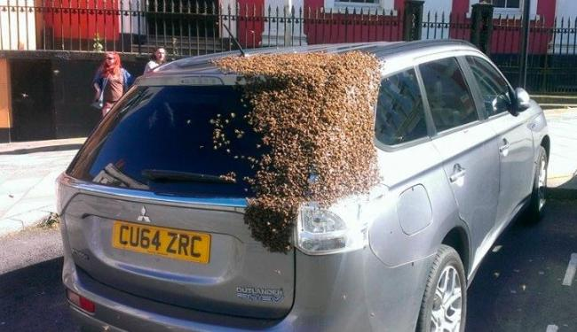

# ABC
Artifitial Bee Colony

ABC feito em C/C++.

Algoritmo de otimização por colônia artificial de abelhas. Feito em C/C++.

Projeto feito para [Qt](https://www.qt.io/download/)

## References
[Passo a passo](http://mf.erciyes.edu.tr/abc/pub/Step%20by%20Step%20Procedure%20of%20ABC.pdf)

[Pseudo-código](http://mf.erciyes.edu.tr/abc/pub/NevImpOfABC.pdf)

[Dervis Karaboga - 2010](http://www.scholarpedia.org/article/Artificial_bee_colony_algorithm)

[Karaboga; Basturk - Artificial Bee Colony (ABC) Optimization Algorithm for Solving Constrained Optimization Problems](http://citeseerx.ist.psu.edu/viewdoc/download?doi=10.1.1.464.446&rep=rep1&type=pdf)