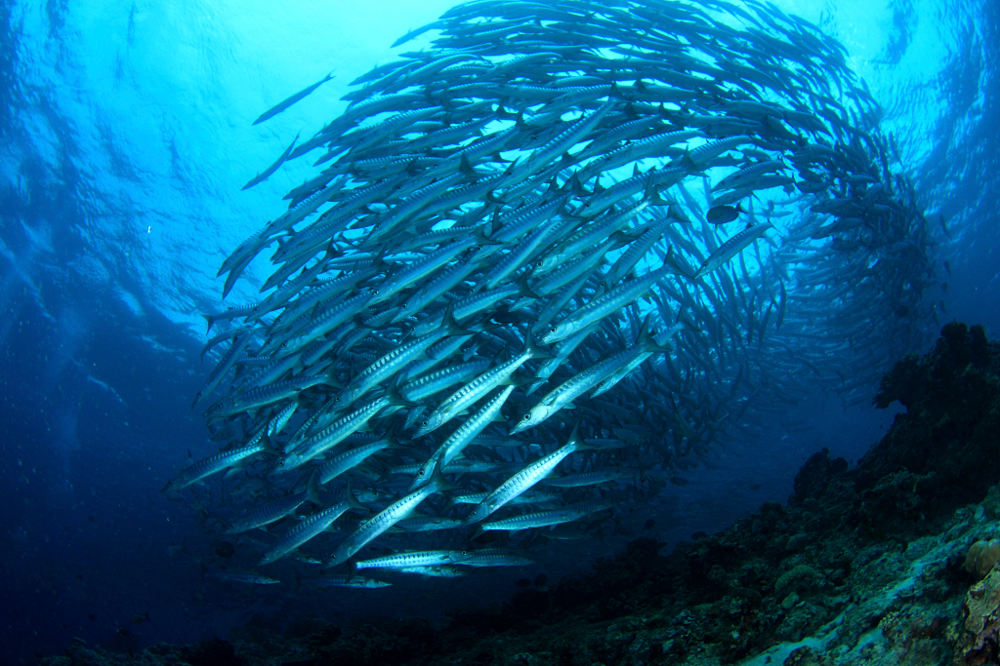

# FSS Algorithm
Fish School Search

Algoritmo de otimização por cardumes de peixes. Feito em C/C++.

Projeto feito para [Qt](https://www.qt.io/download/)

## References
[Operadores](http://www.fbln.pro.br/fss/operators.htm)

[Esqueleto](http://www.fbln.pro.br/fss/versions/Andreas_Janecek-Update_Strategies_for_FSS%28ICSI2011%29.pdf)

